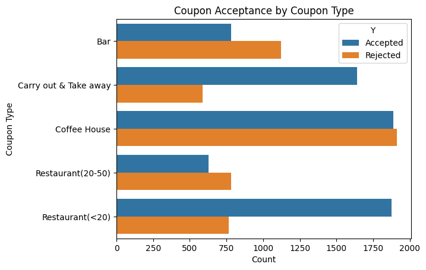
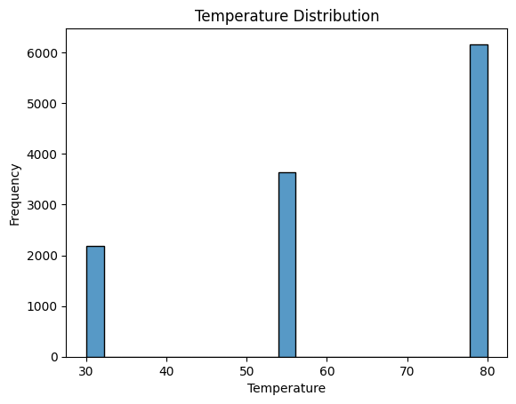
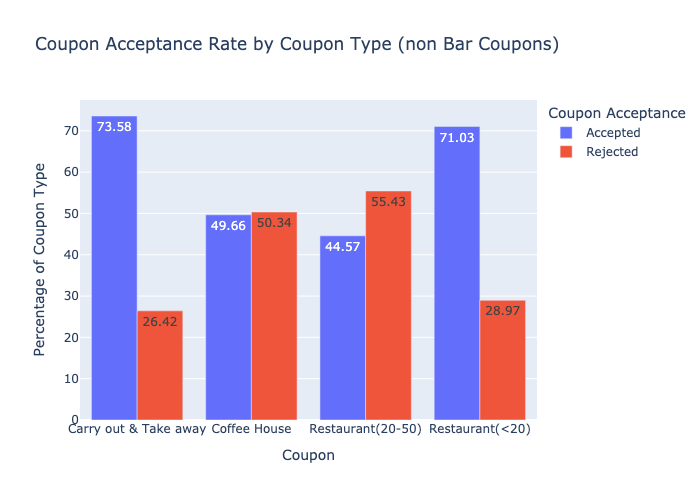
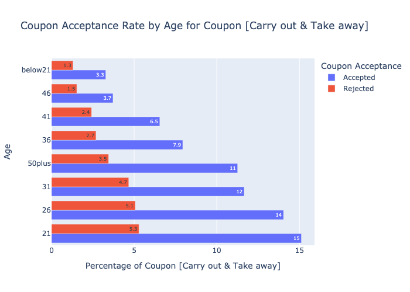
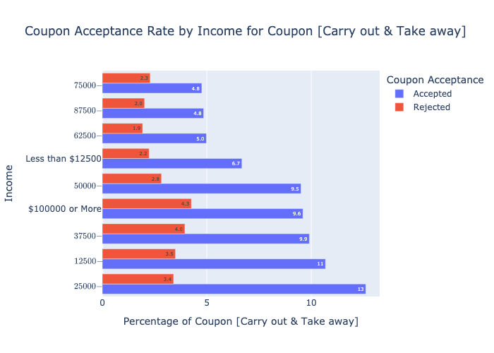
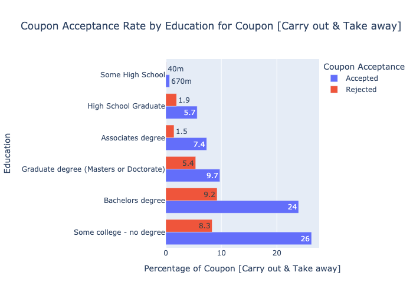
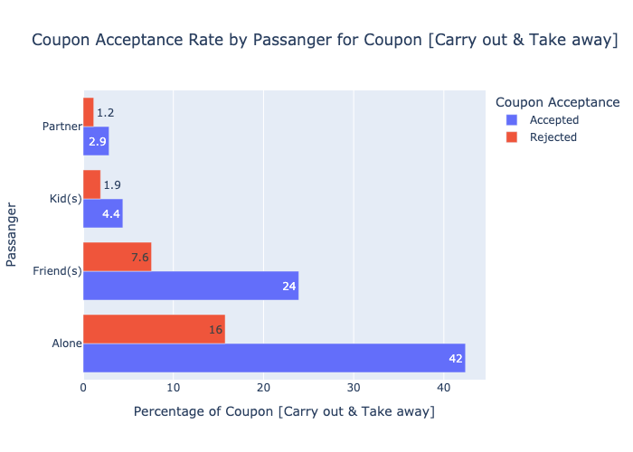
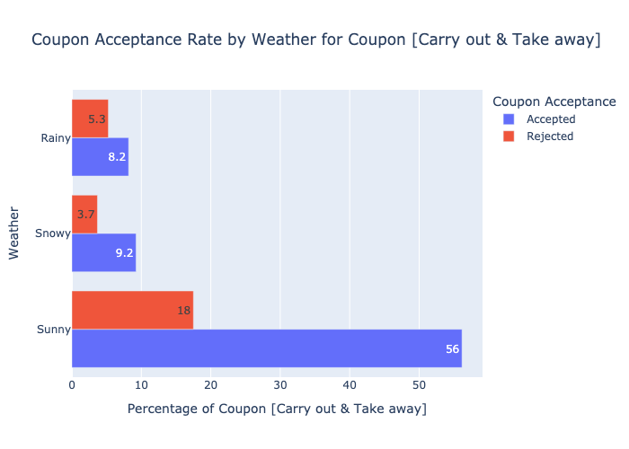

# Assignment 5.1: Will the Customer Accept the Coupon?

[Juypter Notebook](https://github.com/hemant280/coupon-analysis/blob/main/analysis.ipynb).
## Introduction

In this assignment, we will be working with a dataset from the UCI Machine Learning repository and was collected via a survey on Amazon Mechanical Turk. 
The survey describes different driving scenarios including the destination, current time, weather, passenger, etc.. There are 5 different types of coupons 
1. Less expensive restaurants (under \$20) 
2. Coffee houses 
3. Carry out & take away
4. Bar
5. More expensive restaurants (\$20 - $50)

Then the user is asked whether he will accept the coupon if he is the driver, the possible answer that the user can have:
 -  Right away 
 -  Later before the coupon expires 
 -  No, I do not want the coupon

I am new to Working working on data sciene project, while researching I came across a blog post on Medium about similar study. My analysis approach is inspired by the the [blog](https://medium.com/@niralidedaniya/in-vehicle-coupon-recommendation-a-machine-learning-classification-case-study-df67e7835703) post on Medium. 

## Objective
The goal of this project is to use what you know about visualizations and probability distributions to distinguish between customers who accepted a driving coupon versus those who did not.
## Business Understanding
Build visualization and probablity distribution to understand who accepted coupons versus who rejected the coupons
## Data Understanding
The survey describes different driving scenarios including the user’s destination, current time, weather, passenger, coupon attributes, user attributes, and contextual attributes, and then asks the user whether he/she will accept the coupon or not.
<br/>
Dataset file: [Coupon Acceptance Dataset](./data/coupons.csv)
<br/>
The dataset consists of over 12684 data points and 26 attributes
```
<class 'pandas.core.frame.DataFrame'>
RangeIndex: 12684 entries, 0 to 12683
Data columns (total 26 columns):
 #   Column                Non-Null Count  Dtype 
---  ------                --------------  ----- 
 0   destination           12684 non-null  object
 1   passanger             12684 non-null  object
 2   weather               12684 non-null  object
 3   temperature           12684 non-null  int64 
 4   time                  12684 non-null  object
 5   coupon                12684 non-null  object
 6   expiration            12684 non-null  object
 7   gender                12684 non-null  object
 8   age                   12684 non-null  object
 9   maritalStatus         12684 non-null  object
 10  has_children          12684 non-null  int64 
 11  education             12684 non-null  object
 12  occupation            12684 non-null  object
 13  income                12684 non-null  object
 14  car                   108 non-null    object
 15  Bar                   12577 non-null  object
 16  CoffeeHouse           12467 non-null  object
 17  CarryAway             12533 non-null  object
 18  RestaurantLessThan20  12554 non-null  object
 19  Restaurant20To50      12495 non-null  object
 20  toCoupon_GEQ5min      12684 non-null  int64 
 21  toCoupon_GEQ15min     12684 non-null  int64 
 22  toCoupon_GEQ25min     12684 non-null  int64 
 23  direction_same        12684 non-null  int64 
 24  direction_opp         12684 non-null  int64 
 25  Y                     12684 non-null  int64 
dtypes: int64(8), object(18)
memory usage: 2.5+ MB
```
1. User/Driver Attributes
    - Gender: Female, Male
    - Has_children: 0, 1
    - Age: below21, 21, 26, 31, 36,41,46, 50plus
    - Education: 
        Some college - no degree, Bachelors degree, Graduate degree (Masters or Doctorate), Associates degree, High School Graduate, Some High School
    - Income: 
        $25000 - $37499, $12500 - $24999, $37500 - $49999, $100000 or More, $50000 - $62499, Less than $12500, $87500 - $99999, $75000 - $87499, $62500 - $74999
    - Maritalstatus: Married partner, Single, Unmarried partner, Divorced, Widowed
    - Occupation: 
        Unemployed, Student, Computer & Mathematical, Sales & Related, Education&Training&Library, Management, Office & Administrative Support, Arts Design Entertainment Sports & Media, Business & Financial, Retired, Food Preparation & Serving Related, Healthcare Practitioners & Technical, Healthcare Support, Community & Social Services, Legal, Transportation & Material Moving, Architecture & Engineering, Personal Care & Service, Protective Service, Life Physical Social Science, Construction & Extraction, Installation Maintenance & Repair, Production Occupations, Building & Grounds Cleaning & Maintenance, Farming Fishing & Forestry
    - Car: Veichle used by user, this has 99% missing or nan values<br/>
        Scooter and motorcycle, Mazda5, do not drive, crossover, Car that is too old to install Onstar :D
    - Bar: How many times user goes to bar? <br/>
        never, less1, 1~3, 4~8, gt8
    - Carryaway: How many times user take-away the food<br/>
        1~3, 4~8, less1, gt8, never
    - Coffeehouse: How many times user goes to coffee house?<br/>
        less1, 1~3, never, 4~8, gt8
    - Restaurantlessthan20: How many times user goes to restaurant with average expence on $20 or less <br/>
        1~3, 4~8, less1, gt8, never
    - Restaurant20to50: How many times user goes to restaurant with average expence between $20-$50<br/>
        less1, 1~3, never, 4~8, gt8
2. Coupon Attributes
    - Coupon: Type of coupon<br/>
        Coffee House, Restaurant(<20), Carry out & Take away, Bar, Restaurant(20-50)
    - Expiration: When coupon is expired?<br/>
        1d, 2h
3. Target Attribute
    - Y: Coupon Accepted or Rejected <br/>
        accepted:1, Rejected:0
4. Contextual Attributes
    - Destination: User destination<br/>
        No Urgent Place, Home, Work
    - Direction_opp: Restaurant/cafe/bar is in the opposite direction as user’s current destination <br> 
        Yes:1, No:0
    - Direction_same: Restaurant/cafe/bar is in the same direction as user’s current destination<br/> 
        Yes:0, No:1
    - Passanger: Alone, Friend(s), Partner, Kid(s)
    - Weather: Sunny, Snowy, Rainy
    - Temperature: Temparature in F<br/>80, 55, 30
    - Time: Time when user is driving<br/>
        6PM, 7AM, 10AM, 2PM, 10PM
    - Tocoupon_geq5min: The driving distance to the restaurant/cafe/bar for using the coupon is greater than 5 minutes<br/>
        Yes:1, No:0
    - Tocoupon_geq15min: The driving distance to the restaurant/cafe/bar for using the coupon is greater than 15 minutes<br/>
        Yes:1, No:0
    - Tocoupon_geq25min: The driving distance to the restaurant/cafe/bar for using the coupon is greater than 25 minutes<br/>
        Yes:1, No:0
### Data Analysis
    - Remove the duplicate data
        There are 74 duplicate rows in the dataset, so we need to remove them. 
    - Drop the rows for non-drivers
        There are 22 rows with non-drivers 
    - Check missing values and remove them if necessary
        - The Car column has 99% missing values, since this feature has less importance in the analysis dropping the car column from the dataset
        - The coluns: bar, coffeehouse, carryaway, RestaurantLessThan20, and Restaurant20To50 have approximate %1 missing values, droppig the rows with values nan

    - Visvalize coupon colum using bar, additional visvalizations to display accepted/rejected count.

 
    - Visvalize Temparature colum using histogram


## Analysis for Coupon Types
### Bar Coupons
    - % of Bar coupons accepted and rejected
        - Rejected Bar Coupon %  1121 , 58.876 %
        - Accepted Bar Coupon %  783 , 41.124 %
    - Compare the acceptance rate between those who went to a bar 3 or fewer times a month to those who went more.
        - Less than 3 times is 37.24%
        - More than 3 times is 75.92%
    - Compare the acceptance rate between drivers who go to a bar more than once a month and are over the age of 25 to the all others.  Is there a difference?
        - Age more than 25 68.83%
        - Age less than 25 48.95%
        - Yes, Younger people are less likely to accept the Bar coupon
    - Use the same process to compare the acceptance rate between drivers who go to bars more than once a month and had passengers that were not a kid and had occupations other than farming, fishing, or forestry.
        - The Rate of acceptance  70.83%
    - Compare the acceptance rates between those drivers who:
        - go to bars more than once a month, had passengers that were not a kid, and were not widowed *OR*
        - go to bars more than once a month and are under the age of 30 *OR*
        - go to cheap restaurants more than 4 times a month and income is less than 50K.
            - Non-widowed people is 70.83%
            - Younger than 30 is 71.78%
            - Income less than 50 is 46.15%
#### Hypothesis about drivers who accepts the Bar coupon:
    - Drivers who go to bars more than once a month have higher acceptance rate compared to others.
    - Younger people are less likely to accept the Bar coupon.
    - People with occupations other than farming, fishing, or forestry have higher acceptance rate compared to others.
    - Non-widowed people have higher acceptance rate compared to widowed ones.
    - Drivers who go to cheap restaurants more than 4 times a month and income is less than 50K have lower acceptance rate compared to others.


### Independent Investigation

Using the bar coupon example as motivation, you are to explore one of the other coupon groups and try to determine the characteristics of passengers who accept the coupons.  

### High Level Approach to analyse data for drivers accepting copons:
1. Determine coupons other than Bar are popular  
2. Analyize the data and to determine charatersitics of driver accepting popular coupon
#### Goal:
1. Understand and characteristics of coupon whos acceptance rate is high
### Approach
1. Determine which coupon acceptance rate is high
    - Group the data for all coupon types which are not Bar
2. Clean data
    - Remove duplicates
    - Remove records for non-drivers 
    - Drop column car 
    - Drop rows with NaN or Null values 
3. Identify the coupon acceptance rate
    - Calculate acceptance rate by different attributes like time of day, destination etc.
    - Plot acceptance rate by different attributes to visualize the acceptance rate
4. Draw conclusions from analysis
5. Present findings in report or presentation in markdown format

### NonBar coupon acceptance rate
    - The coupon with lowest acceptance rate 'Restaurant(<20)'
    - The coupon with highest acceptance rate  'Carry out & Take away'


#### Analyize Highest Acceptance Rate Coupons:
- Visvalize Highest Acceptance rate coupons: 
    - Age of Driver
    - Income of Driver
    - Education
    - Driving with Passanger
    - Weather

#### Visualization

- **Age of Driver**
 
- **Income of Driver**
 
- **Education**
 
- **Driving with Passanger**

- **Wather**
 

### Observation
#### The coupon with highest acceptance rate is **Carry out & Take away**
    1. Age is a significant factor in the acceptance of the coupon Carry out & Take away. Drivers in the range of 21-26 most likely accept this coupon. 
    2. The income another significant factor in the acceptance of Carry out & Take away coupon. Drivers with income less than $37,500 have lower acceptance rate compared to others.
    3. Education plays a key factor in the acceptance of Carry out & Take away coupon. Drivers with less than high school education have lower acceptance rate compared to others
    4. If a driver is travaling alone the acceptance of Carry out & Take away coupon is higher with friends or family members
    5. Weatherher also plays a key role in the acceptance of Carry out & Take away coupon. Drivers are more likely to accept coupons on clear weather compared to other weather conditions

#### Referance
  A. Medium blog post: https://medium.com/@niralidedaniya/in-vehicle-coupon-recommendation-a-machine-learning-classification-case-study-df67e7835703